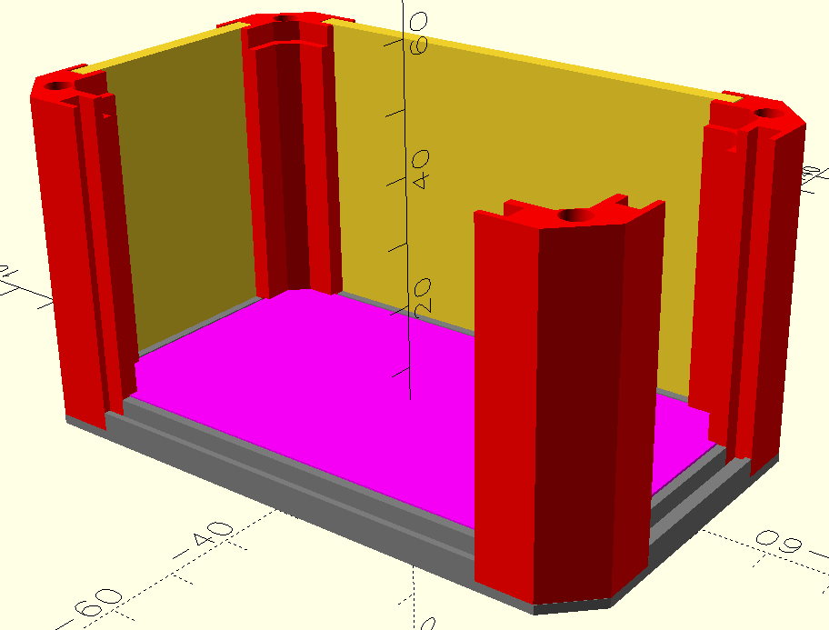

Ein paar Dateien zu diesem Projekt im openscad format, weil ich nicht extra andere Software nutzen will:

* https://www.heise.de/ratgeber/Radio-Netzteil-oder-Messgeraet-Ein-modulares-Gehaeuse-im-Selbstbau-11332936.html
* https://github.com/MakeMagazinDE/Steckgehaeuse

Ein einfaches Gehaeuse aus dem 3D Drucker, dessen Teile skalierbar und modular sind.

